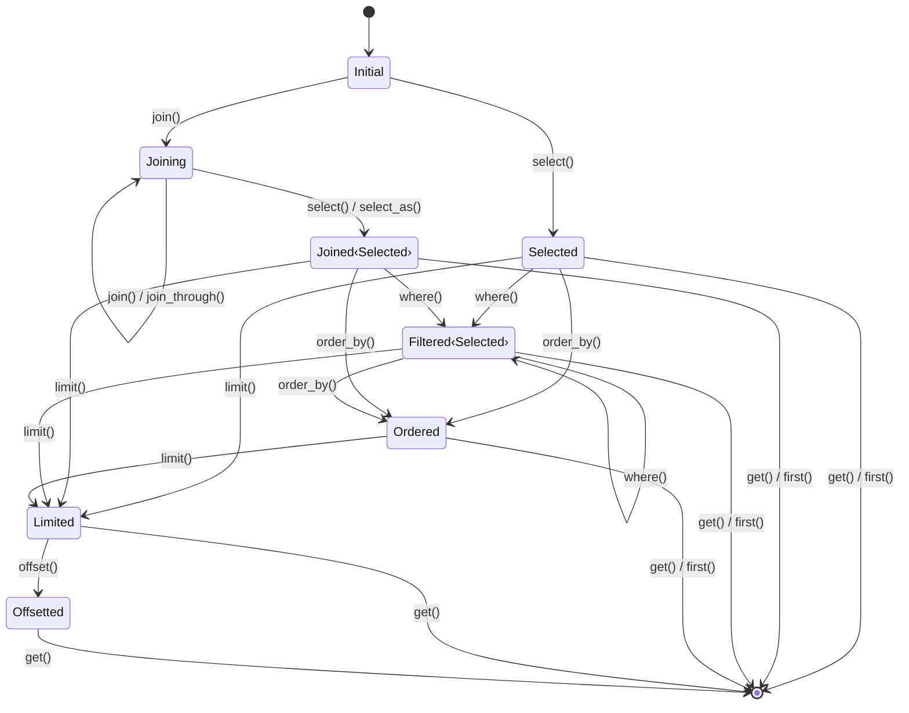
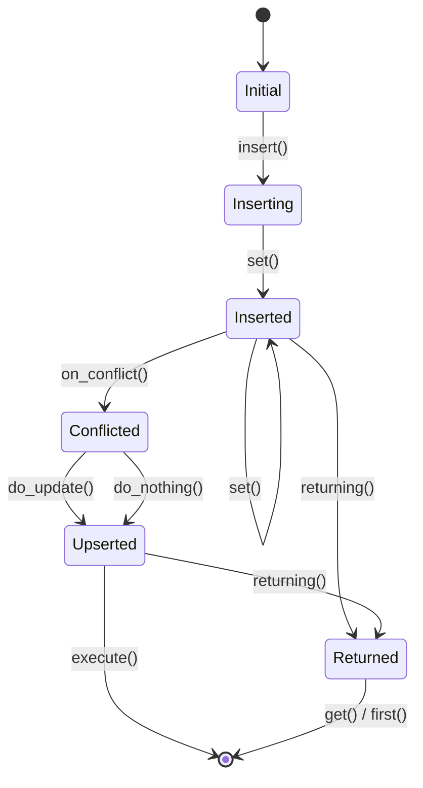
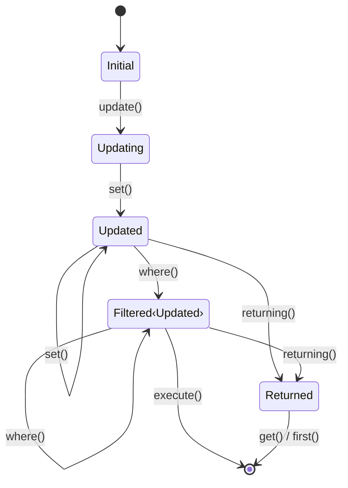

# Query Builder

## What is a Query Builder?

A query builder is an abstraction that constructs SQL queries programmatically.
Rather than writing SQL as strings, methods are called to build the query piece
by piece. The builder handles SQL syntax, parameter binding, and escaping.

Fabrique's query builder adds compile-time type checking to this pattern. The
Rust compiler validates that queries are well-formed before the code runs.

## The Typestate Pattern

Fabrique uses the **typestate pattern** to encode query state in the type
system. Each method call changes the type of the builder, and only certain
methods are available for each type.

When `select()` is called on an `Initial` builder, a `Selected` builder is
returned. The `Selected` type exposes different methods than `Initial`. This
type-level tracking lets the compiler verify query structure.

### How It Works

The builder's type includes a state parameter: `QueryBuilder<S, Joins, Output>`.
The `S` parameter changes as the query is built, and the root model is derived
from the `Joins` HList:

- `QueryBuilder<Initial, Joined<Product, ()>>` — just created
- `QueryBuilder<Building<Db, Selected>, Joined<Product, ()>>` — after `select()`
- `QueryBuilder<Building<Db, Filtered<Selected>>, Joined<Product, ()>>` — after
  `where()`

Each state type determines which methods exist. `offset()` is only defined for
`Limited`, so calling it on `Selected` fails at compile time.

### Benefits

The typestate pattern brings several advantages:

- **Compile-time validation**: Invalid queries are rejected by the compiler,
  catching errors before tests even run
- **Zero runtime overhead**: States are zero-sized types that exist only at
  compile time
- **Guided API discovery**: IDE autocompletion shows only the methods that are
  valid in the current state
- **Self-documenting code**: The type signature reveals what operations have
  been applied to the query

## Two-Layer Architecture

Fabrique separates the query builder into two layers, each with distinct responsibilities:

### SQL Layer (`fabrique::sql::QueryBuilder`)

The SQL layer generates raw SQL strings. It works with table and column names as
strings, without knowledge of Rust models. This layer handles:

- SQL clause ordering
- Parameter binding
- Statement generation

By isolating SQL generation, this layer can be tested independently and
potentially extended to support multiple database backends.

### Model Layer (`fabrique::QueryBuilder`)

The Model layer wraps the SQL layer, adding model awareness:

- **Automatic table resolution**: Table names are derived from the model type
- **Type-safe columns**: Column references use generated constants that carry
  type information
- **Join validation**: The `Joins` type parameter tracks which models have been
  joined, enabling compile-time checks on cross-model filters

When methods are called on the Model layer, it delegates to the SQL layer for
actual SQL generation while adding its own compile-time guarantees.

## State Machine

The query builder implements a finite state machine. States represent valid
points in query construction, and methods are transitions between states.

### SELECT Flow

### INSERT Flow

### UPDATE Flow

### State Design

The states mirror SQL clause structure. SQL has rules about ordering—`ORDER BY`
comes after `WHERE`, `OFFSET` requires `LIMIT`. The state machine encodes these
rules.

Some states are parameterized. `Filtered<Selected>` and `Filtered<Updated>`
share filtering behavior but lead to different execution methods. The inner type
tracks the query's origin.

Most states are zero-sized types (ZSTs). They exist only at compile time with no
runtime cost. The exception is `Inserted`, which accumulates column names and
values because INSERT syntax requires the full column list before generating
SQL.

## Join Tracking

The `Joins` type parameter tracks which models have been joined to the query.
This enables compile-time validation when filtering on columns from related
models.

When `.join::<Order>()` is called, the `Joins` type grows to include `Order`.
Subsequent `where()` calls check whether the column's model appears in `Joins`.
Filtering on `Order::USER_ID` without joining `Order` causes a compile-time
error.

This validation uses Rust's trait system. The `Contains<Model, Index>` trait is
implemented for type-level lists containing the model. The `where()` method
requires this trait as a bound, so missing joins cause compilation to fail.

This provides immediate feedback during development: the IDE shows an error as
soon as a column from an unjoined model is referenced, rather than waiting for a
database error at runtime.
